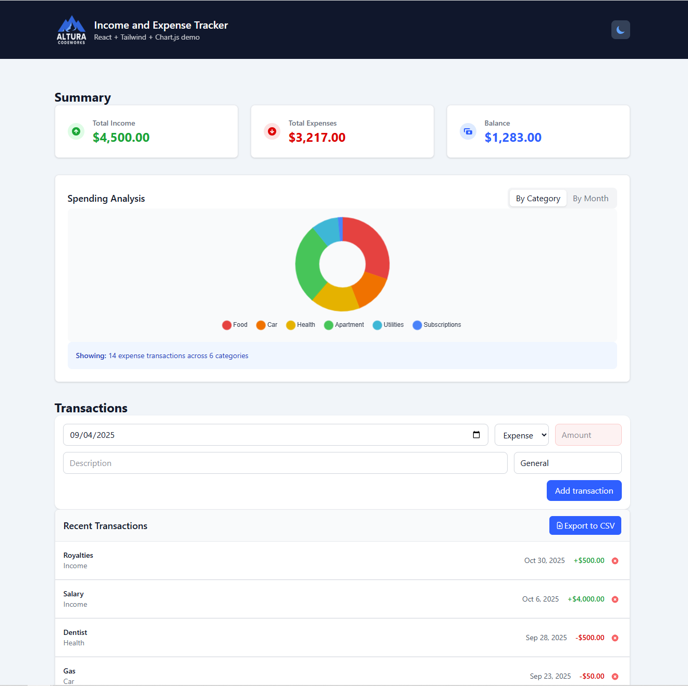

# 💰 Income and Expense Tracker  
*A simple React + Tailwind demo showcasing clean UI, local state management, and chart visualization.*



---

## 🚀 Live Demo
🔗 **[Open on Vercel](https://expense-tracker-demo-app.vercel.app/)**  

---

## 🧱 Tech Stack
| Layer | Technologies |
|-------|---------------|
| **Frontend** | React (Vite + TypeScript), Tailwind CSS, Chart.js / react-chartjs-2 |
| **State** | Custom React Hooks + Context |
| **Persistence** | LocalStorage (no backend required) |

---

## ✨ Features
- 📊 **Summary dashboard** — total income, total expenses, and net balance  
- 🥧 **Interactive charts** — category-based or month-based spending breakdown  
- 💾 **Local persistence** — data stored automatically in `localStorage`  
- 🧾 **Quick transactions** — add/remove income and expenses in real-time  
- 📱 **Responsive layout** — optimized for desktop and mobile  
- 🌗 **Dark theme support** - dark/light mode toggle using Tailwind’s `dark:` classes  
- **CSV** - export transactions to CSV file

---

## 🧩 How to Run Locally

```bash
# 1️⃣ Clone the repo
git clone https://github.com/ymykhal/expense-tracker-demo-app.git
cd expense-tracker-demo-app

# 2️⃣ Install dependencies
npm install

# 3️⃣ Start dev server
npm run dev

--- 

* Then open http://localhost:5173 in your browser.

👨‍💻 Author

Yuriy Mykhalchuk
Founder of Altura Codeworks https://alturacodeworks.com/ 

🔗 LinkedIn https://www.linkedin.com/in/yuriy-mykhalchuk-b964ba10/
 · Upwork https://www.upwork.com/freelancers/~019fb7153779620a63

📄 License

MIT — free for demonstration and educational use.